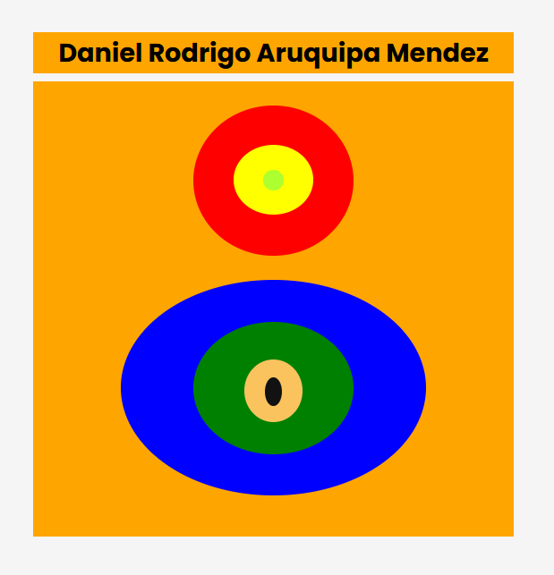

# TAREA 1

Este es un sitio web sencillo desarrollado en HTML y CSS para mostrar circulos.

## Descripción

Este proyecto es la primera tarea de desarrollo web 2.

## Características

- **HTML5 y CSS3:** Uso de las últimas versiones de estas tecnologías.

## Tecnologías Utilizadas

- [HTML5](https://developer.mozilla.org/es/docs/Web/HTML)
- [CSS3](https://developer.mozilla.org/es/docs/Web/CSS)
